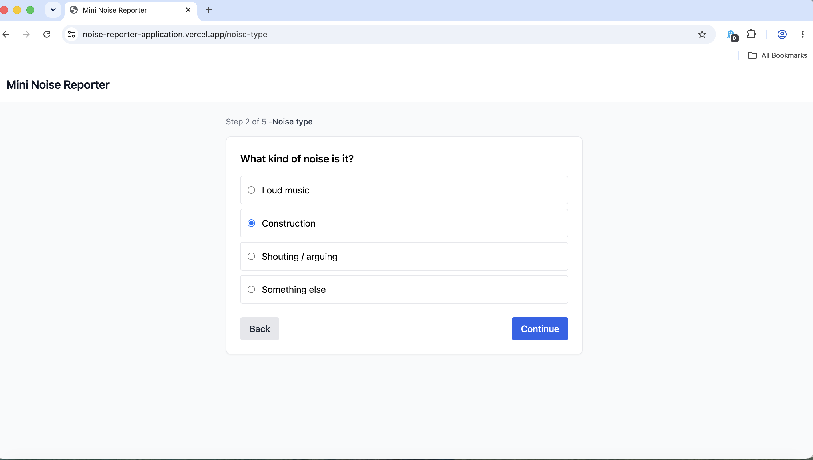

# Mini Noise Reporter

A Mini Noise Reporter Application to report disturbances within the area.

**Live demo:** [noise-reporter-application.vercel.app](https://noise-reporter-application.vercel.app)

## Stack

- React 18 + TypeScript
- Vite (dev server + build tool)
- React Router (multi-page navigation)
- Zustand (global form state across pages)
- TanStack Query (submission + loading/error states)
- Zod (form validation)
- Tailwind CSS (styling)

## The user journey

1. **Start** — intro page, click "Start report"
2. **Noise type** — pick a type (music, construction, etc.)
3. **Noise details** — how long has it been happening + a description
4. **Your details** — name + email, validated with Zod
5. **Confirmation** — shows a fake case reference returned from a mocked submission
